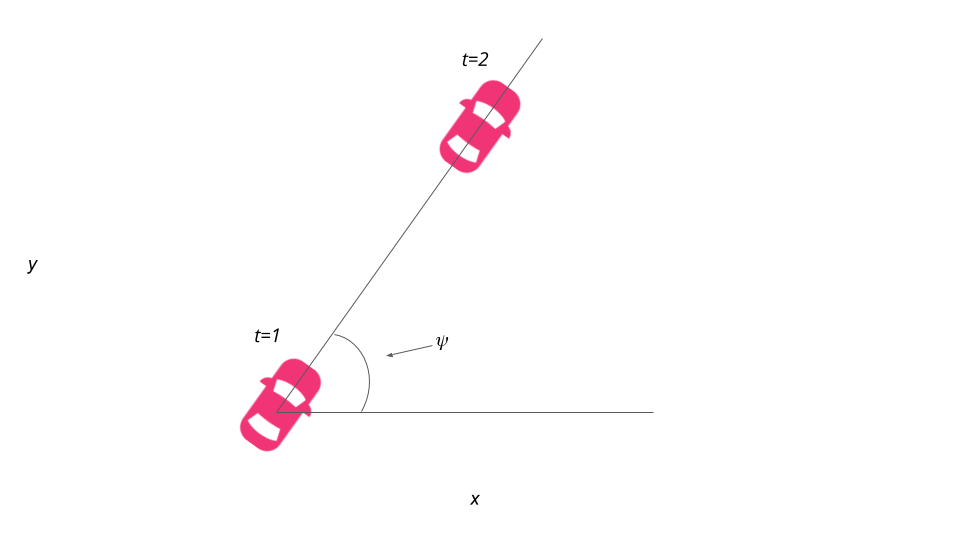

# CarND Controls Quizzes

Quizzes for *Vehicle Models* and *Model Predictive Control* sections.

Code for these assignments can be found in following directories:

1. [Global Kinematic Model Quiz](./global_kinematic_model) - Implement the *Global Kinematic Model*.
2. [Polynomial Fitting Quiz](./polyfit) - Fit and evaluate polynomials.
3. [Mind The Line Quiz](./mpc_to_line) - Implement MPC and minimize cross track and orientation errors to a straight line trajectory.  See [this document](https://github.com/udacity/CarND-MPC-Quizzes/blob/master/install_Ipopt_CppAD.md) for setup tips for executing the plotting code in the ```MPC.cpp``` solution file.

To run:

1. Go to quiz directory.
2. Make a build directory with `mkdir build`.
3. Change into the build directory, `cd build`.
4. Compile the project, `cmake .. && make`.

A solution for each quiz is presented in the solution directory.

Docker environment is used which doesn't work with matplotlib, hence data from Mind The Line Quiz is written in a text file and post processed using python script [plot.py](./mpc_to_line/src/plot.py) and plot saved as [output](./mpc_to_line/build/output.png) 


## Dependencies

The *Global Kinematic Quiz* and *Polynomial Fitting* quizzes have all the dependencies in repo. For the *MPC* quiz
you'll have to install Ipopt and CppAD.  Please refer to [this document](https://github.com/udacity/CarND-MPC-Quizzes/blob/master/install_Ipopt_CppAD.md) for installation instructions.


# Global Kinematic Model Quiz
---

## Vehicle Models
### Kinematic Models
Kinematic models are simplifications of dynamic models that ignore tire forces, gravity, and mass. This simplification reduces the accuracy of the models, but it also makes them more tractable.At low and moderate speeds, kinematic models often approximate the actual vehicle dynamics.

### Dynamic Models
Dynamic models aim to embody the actual vehicle dynamics as closely as possible. 
They might encompass tire forces, longitudinal and lateral forces, inertia, gravity, air resistance, drag, mass, and the geometry of the vehicle.Not all dynamic models are created equal! Some may consider more of these factors than others.Advanced dynamic models even take internal vehicle forces into account - for example, how responsive the chassis suspension is.

### Building a Model
We are using Bicycle model to define the state of the model.



x,y are next position, psi is heading direction,and velocity is vehicle velocity.
Next state is calculated as:


for psi:
we add a multiplicative factor of the steering angle,δ to ψ.

Lf measures the distance between the center of mass of the vehicle and it's front axle. The larger the vehicle, the slower the turn rate.

If you've driven a vehicle you're well aware at higher speeds you turn quicker than at lower speeds. This is why v is the included in the update.

v=v+a∗dt

where a can take value between and including -1 and 1

a represents an actuator which is combination of throttle (max at 1) or brake (-1).

### How Lf was chosen for this project:
On the topic of running a vehicle around in a circle, this is actually a good way to test the validity of a model! If the radius of the circle generated from driving the test vehicle around in a circle with a constant velocity and steering angle is similar to that of your model in the simulation, then you're on the right track. This type of approach was used to tune Lf
​	 .

From the image below, we can see that the vehicle started at the origin, oriented at 0 degrees. We then simulated driving with a δ value of 1 degree and adjusted Lf to arrive at a final value of 2.67 . This is the value that produced a circle, with all other variables held constant.


# Polynomial Fitting Quiz


As shown in picture above, the reference trajectory is typically passed to the control block as a polynomial. This polynomial is usually 3rd order, since third order polynomials will fit trajectories for most roads. To practice this most common situation, we will learn how to fit 3rd order polynomials to waypoints (x, y) in C++ using Eigen, and evaluate the output. Your tasks are:

1. Use polyfit to fit a 3rd order polynomial to the given x and y coordinates representing waypoints.
2. Use polyeval to evaluate y values of given x coordinates.


We can capture how the errors we are interested in change over time by deriving our kinematic model around these errors as our new state vector.

The new state is [x,y,ψ,v,cte,eψ].

Let’s assume the vehicle is traveling down a straight road and the longitudinal direction is the same as the x-axis.


### Cross Track Error
We can express the error between the center of the road and the vehicle's position as the cross track error (CTE). The CTE of the successor state after time t is the state at t + 1, and is defined as:

cte(t+1)=cte(t) +v(t)∗sin(eψ(t))∗dt

In this case cte(t)can be expressed as the difference between the line and the current vehicle position y. Assuming the reference line is a 1st order polynomial f, f(x(t))  is our reference line and our CTE at the current state is defined as:
cte(t)=y(t)−f(x(t)

If we substitute cte(t) back into the original equation the result is:
cte(t+1)=y(t)−f(x(t))+(v(t) ∗sin(eψ(t))∗dt)

This can be broken up into two parts:

1.	y(t)−f(x(t)) being current cross track error.
2.  v(t)∗sin(eψ(t))∗dt being the change in error caused by the vehicle's movement.


### Orientation Error
Ok, now let’s take a look at the orientation error:


eψ(t+1)=eψ(t) + v(t)/Lf *δ(t)∗dt	

The update rule is essentially the same as ψ.

eψ(t) is the desired orientation subtracted from the current orientation:

e\psi_t = \psi_t - \psi{des}_t 
eψ(t)=ψ(t)−ψdes(t)


We already know ψ(t), because it’s part of our state. We don’t yet know ψdes(t) (desired psi) - all we have so far is a polynomial to follow. ψdes(t)can be calculated as the tangential angle of the polynomial f evaluated at x(t), arctan(f′(x(t))). f′ is the derivative of the polynomial.

eψ(t+1) =ψ(t)−ψdes(t)+(v(t)/Lf ∗δ(t)∗dt)


Similarly to the cross track error this can be interpreted as two parts:

1.  ψ(t)−ψdes(t) being current orientation error.
2. v(t)/Lf ∗δ(t) ∗dt being the change in error caused by the vehicle's movement.


# What we have learned so far about Models
From the previous lessons we have learned to apply the bicycle model, polynomial fitting, low complexity heuristics (e.g. CTE), and short time steps, to enable vehicles to follow a complex (polynomial) trajectories. This is an effective, practical, and commonly used approach, which can be applied to many autonomous vehicle scenarios, in real time.

The Lectures follows on to vehicle models with an overview of the more comprehensive, but less practical, dynamic models. Dynamic models and the elements which comprise them are rigorous and could be modules or courses unto themselves. The content that follows is targeted developing awareness and intuition that can be applied to further study and consists of:

Dynamic Model Forces
1. Tire Slip Angle
2. Tire Slip Ratio
3. Tire Models
Additional resources are linked to each lesson to encourage and enable more in depth study [Link](http://www.me.berkeley.edu/~frborrel/pdfpub/IV_KinematicMPC_jason.pdf)

Compared to higher fidelity vehicle models, the system identification on the kinematic bicycle model is easier because there are only two parameters to identify, lf and lr. This makes it simpler to port the same controller or path planner to other vehicles with differently sized wheelbases.

To further expand on this, lower complexity models have two strong advantages over higher complexity (dynamic included) models. They can run in real time (essential requirement of any model operating in a vehicle) and they are transferable to vehicles with differing attributes, such as mass. To use a dynamic model engineers would have to be able to control the vehicle attributes of the vehicles they are deploying models into (they probably won't have control over this). High complexity models would need major re-adjustment to account for even small differences. Lower complexity models do not suffer from this constraint and so can be placed in a wider range of vehicles, with far less additional effort, and unpredictability.

Another frequently asked question is where our model comes from and why it differs from other models seen in the program and from other sources.

The kinematic model we derive and use here is not quite the same as in the Berkeley paper (linked above), although they are similar. It is possible to use different models in different parts of your pipeline, depending on what levels of accuracy you need in different places. It is common to see this in industry. The principles of model we present can be applied to add parameters into the model to make models fit to purpose.

Additional Reading
1. [Pacejka Tire Model or Magic Tire Formula](http://www.theoryinpracticeengineering.com/resources/tires/pacejka87.pdf)
2. [This paper presents a comparison between a kinematic and dynamic model](http://www.me.berkeley.edu/~frborrel/pdfpub/IV_KinematicMPC_jason.pdf)
3. [A brief overview of essential topics in vehicle dynamics](http://www.springer.com/cda/content/document/cda_downloaddocument/9783658039776-c1.pdf?SGWID=0-0-45-1468312-p176308738)
4. [Drew Gray's dissertation thesis This contains an excellent review, additional resources, and novel approaches/findings](https://escholarship.org/uc/item/1s2777sr)
5. [An excellent book This is not a free resource but is highly recommended by domain experts](http://www.springer.com/us/book/9781461414322)

# Mind The Line Quiz

MPC attempts to approximate a continuous reference trajectory by means of discrete paths between actuations. Larger values of dt result in less frequent actuations, which makes it harder to accurately approximate a continuous reference trajectory. This is sometimes called "discretization error".

## Cost Function:
A good start to the cost function is to think of the error that you would like to minimize. For example, measuring the offset from the center of the lane, where the center of the lane can be called the reference, or desired, state.
We previously captured two errors in our state vector: cte and eψ.

Ideally, both of these errors would be 0 - there would be no difference from the actual vehicle position and heading to the desired position and heading.

Our cost should be a function of how far these errors are from 0.
Additional aspects such as smooth transition from one state to another such that the steering angle doesn't change sudenly can be part of cost function

## Horizon
In the case of driving a car, T should be a few seconds, at most. Beyond that horizon, the environment will change enough that it won't make sense to predict any further into the future.


The prediction horizon is the duration over which future predictions are made. We’ll refer to this as T.T is the product of two other variables, N and dt.N is the number of timesteps in the horizon. dt is how much time elapses between actuations. For example, if N were 20 and dt were 0.5, then T would be 10 seconds.N, dt, and T are hyperparameters you will need to tune for each model predictive controller you build. However, there are some general guidelines. T should be as large as possible, while dt should be as small as possible.These guidelines create tradeoffs.

## Number of Timesteps
The goal of Model Predictive Control is to optimize the control inputs: [a,δ]. An optimizer will tune these inputs until a low cost vector of control inputs is found. The length of this vector is determined by N:

[δ1,a1,δ2,a2,...,δN−1,aN−1]

Thus N determines the number of variables optimized by the MPC. This is also the major driver of computational cost.

## Timestep Duration
MPC attempts to approximate a continuous reference trajectory by means of discrete paths between actuations. Larger values of dt result in less frequent actuations, which makes it harder to accurately approximate a continuous reference trajectory. This is sometimes called "discretization error".

A good approach to setting N, dt, and T is to first determine a reasonable range for T and then tune dt and N appropriately, keeping the effect of each in mind.

 
** The blue line is the reference trajectory and the red line the trajectory computed by Model Predictive Control. In this example the horizon has 7 steps, N, and the space in between white pebbles signifies the time elapsed, dt. **

## MPC Loop


## Latency
In a real car, an actuation command won't execute instantly - there will be a delay as the command propagates through the system. A realistic delay might be on the order of 100 milliseconds.

This is a problem called "latency", and it's a difficult challenge for some controllers - like a PID controller - to overcome. But a Model Predictive Controller can adapt quite well because we can model this latency in the system.

PID Controller
PID controllers will calculate the error with respect to the present state, but the actuation will be performed when the vehicle is in a future (and likely different) state. This can sometimes lead to instability.

The PID controller could try to compute a control input based on a future error, but without a vehicle model it's unlikely this will be accurate.

Model Predictive Control
A contributing factor to latency is actuator dynamics. For example the time elapsed between when you command a steering angle to when that angle is actually achieved. This could easily be modeled by a simple dynamic system and incorporated into the vehicle model. One approach would be running a simulation using the vehicle model starting from the current state for the duration of the latency. The resulting state from the simulation is the new initial state for MPC.

Thus, MPC can deal with latency much more effectively, by explicitly taking it into account, than a PID controller.

In this quiz We use MPC to follow the trajectory along a line.

Steps:

1. Set N and dt.
2. Fit the polynomial to the waypoints.
3. Calculate initial cross track error and orientation error values.
4. Define the components of the cost function (state, actuators, etc). You may use the methods previously discussed or make up something, up to you!
5. Define the model constraints. These are the state update equations defined in the Vehicle Models module.

Let's go over the libraries you'll use for this quiz and the following project.

## [Ipopt](https://projects.coin-or.org/Ipopt/)
Ipopt is the tool we'll be using to optimize the control inputs[δ1,a1,...,δN−1,aN−1]. It's able to find locally optimal values (non-linear problem!) while keeping the constraints set directly to the actuators and the constraints defined by the vehicle model. Ipopt requires we give it the jacobians and hessians directly - it does not compute them for us. Hence, we need to either manually compute them or have a library do this for us. Luckily, there is a library called CppAD which does exactly this.

## [CppAD](https://www.coin-or.org/CppAD/)
CppAD is a library we'll use for automatic differentiation. By using CppAD we don't have to manually compute derivatives, which is tedious and prone to error.

In order to use CppAD effectively, we have to use its types instead of regular double or std::vector types.

## Code structure
Note Ipopt expects all the constraints and variables as vectors. For example, suppose N is 5, then the structure of vars a 38-element vector:

vars[0],...,vars[4] -> [x_1, ...., x_5]

vars[5],...,vars[9] -> [y_1, ...., y_5]

vars[10],...,vars[14] -> [ψ1,....,ψ5]

vars[15],...,vars[19] -> [v_1, ...., v_5]

vars[20],...,vars[24] -> [cte_1, ...., cte_5]

vars[25],...,vars[29] -> [eψ1,....,eψ5]

vars[30],...,vars[33] -> [δ1,....,δ4]

vars[34],...,vars[37] -> [a_1, ...., a_4]

We then set lower and upper bounds on the variables. Here we set the range of values δ to [-25, 25] in radians:

for (int i = delta_start; i < a_start; i++) {

    vars_lowerbound[i] = -0.436332;

    vars_upperbound[i] = 0.436332;

  }

### Constraints
Next the we set the lower and upper bounds on the constraints.

Consider, for example:

xt+1=xt +vt∗cos(ψt)∗dt

This expresses that xt+1 **MUST** be equal to xt+vt∗cos(ψt)∗dt. Put differently:

xt+1−(xt+vt∗cos(ψt)∗dt)=0